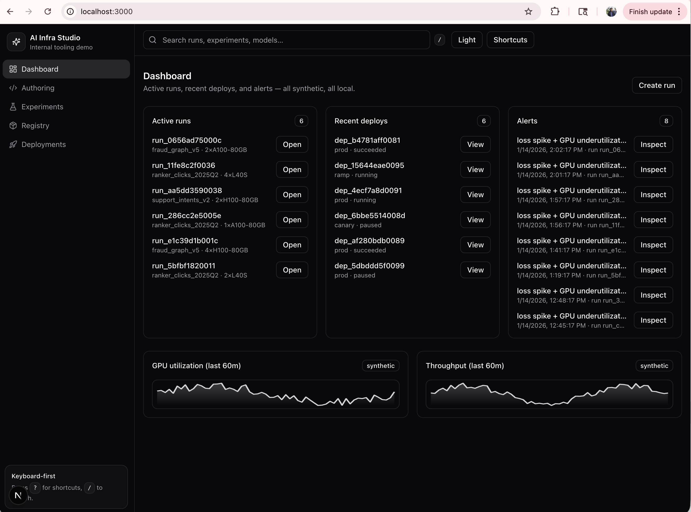
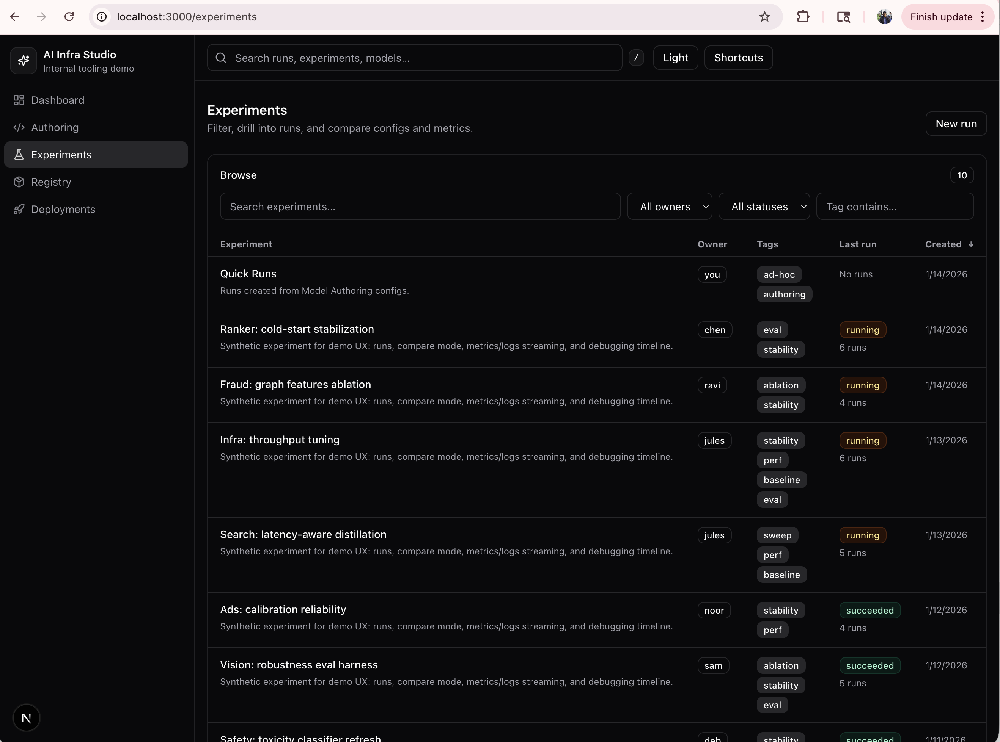
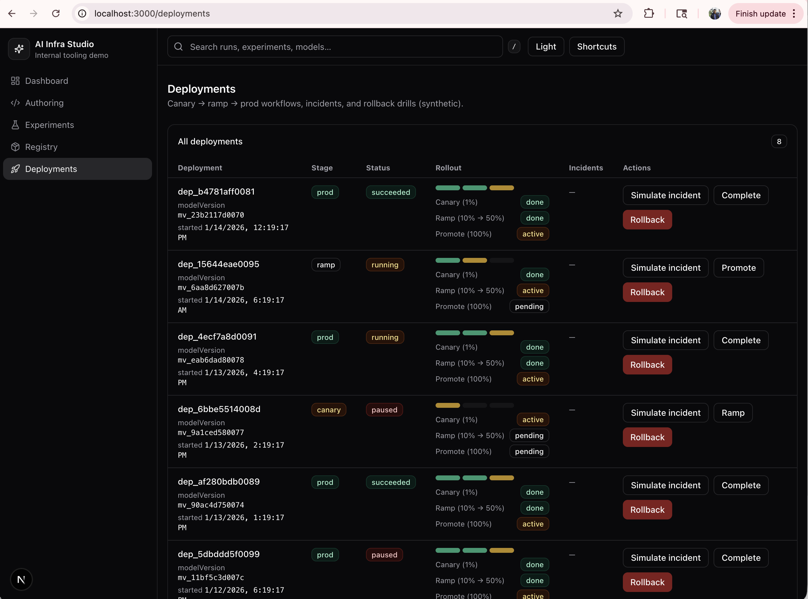

# AI Infra Studio

Local demo of a fictional internal AI infrastructure platform: model authoring, experiments, run observability, deployment workflows, and debugging/tracing. Everything is synthetic (no real training, no external APIs, no proprietary branding).

## What you can do

- Author a model config in Monaco (YAML/JSON), validate it, diff versions, and create a synthetic run.
- Browse experiments, open an experiment, and compare two runs (metric deltas + config diff).
- Open a run’s observability view (live metrics + virtualized logs) and debug with the **Time Warp Timeline** (pin moments + compare pins).
- Browse a model registry and simulate a deployment rollout with incidents and rollback suggestions.
- Inspect a synthetic request trace with a step-by-step pipeline view and a “replay” panel.

## Screenshots / GIFs

Add images under `docs/screenshots/` and reference them here.

Suggested captures:
- Run detail → Timeline tab: brush-zoom + pin two moments + compare
- Run detail → Logs tab: search + pin a log line + jump-to-time
- Experiments → Compare runs: config diff + metric deltas
- Deployments: simulate incident → rollback

## Running locally

Prereqs: Node.js `>= 20`, `pnpm` (or `corepack`).

```bash
cd AI-Infra-studio
pnpm i
pnpm dev
```

- Web: `http://localhost:3000`
- API: `http://localhost:4000`

### Environment variables

- `NEXT_PUBLIC_API_BASE_URL` (web) defaults to `http://localhost:4000`
- `WS_CHAOS_DISCONNECT=1` (api) forces periodic WS drops (to exercise reconnect UI)

## Keyboard shortcuts

- `g d` dashboard
- `g e` experiments
- `g r` registry
- `g p` deployments
- `/` focus global search
- `?` open shortcuts modal

## Failure modes (for demo realism)

- REST “chaos mode”: append `?chaos=1` to API calls (the UI has a toggle in a few places) to get occasional `500`s.
- WS disconnects: set `WS_CHAOS_DISCONNECT=1` for random disconnects; the run page shows a “Reconnecting…” badge and recovers.

## Architecture (high level)

```text
┌───────────────┐        REST         ┌────────────────────┐
│ apps/web      │ ──────────────────► │ apps/api (Fastify)  │
│ Next.js (App) │                    │ + WS streaming       │
│ React Query   │ ◄────────────────── │ /ws/runs/:id         │
└───────────────┘        WS           └─────────┬───────────┘
                                                │
                                                ▼
                                        ┌──────────────────┐
                                        │ packages/mock-data │
                                        │ deterministic seed │
                                        └──────────────────┘
```

Data is generated deterministically from a seed and kept in-memory in the API process. Mutations like “Create Run” and “Simulate incident” update the store for the session.

## Folder structure

```text
/apps
  /web        Next.js UI
  /api        Fastify REST + WebSocket server
/packages
  /ui         shared UI primitives + tokens
  /types      shared TS types
  /mock-data  synthetic data + in-memory store
/docs
  architecture.md
  ux-notes.md
  decisions.md
```

## Tests

```bash
pnpm test
pnpm e2e
```

`pnpm e2e` runs Playwright against a dedicated dev stack on ports `3100/4100` to avoid clobbering a manually running `pnpm dev`.

If you don’t want Playwright to download browsers, use your locally installed Chrome:

```bash
PLAYWRIGHT_CHANNEL=chrome pnpm e2e
```

## Roadmap

- Command palette (`cmd+k`) that searches runs/experiments/models
- Smarter “what changed?”: correlate pinned moments with config deltas and deployment events
- More observability tracks (I/O throughput, CPU, memory) and richer alert simulation
- Artifact viewer improvements (preview + provenance)

## License

No license file is included yet. If you plan to share or reuse this publicly, add a `LICENSE` (MIT/Apache-2.0 are common choices).
## Screenshots / GIFs





